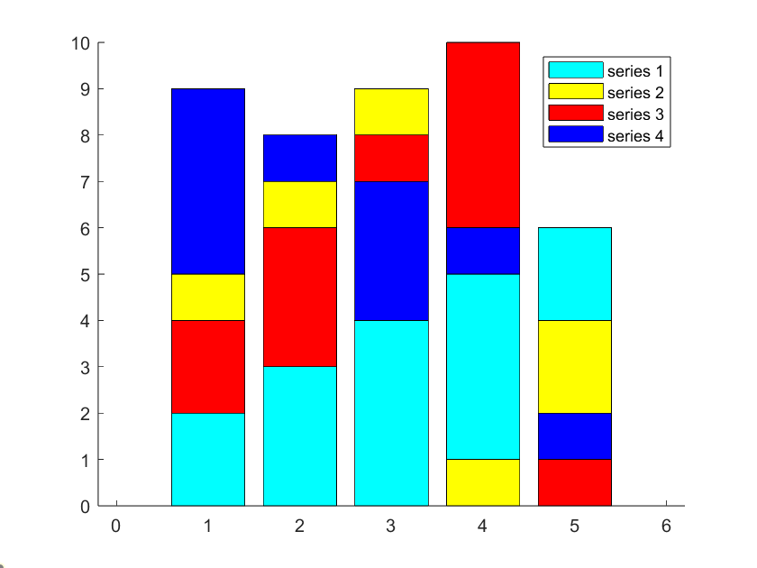

# solidHistogram
So, I wanted to create beautiful histogram plots in [PGF/TikZ](https://tikz.dev/), where I compared the error histogram of three different control algorithms. Classically, one would plot three different histograms. Apart from making the three plots harder to compare, it also wastes valuable page space in the paper manuscript. Another approach would be to add opacity to each bar plot. While this approach works great for merging two histograms, this can get messy for three or more data series.
 To address this, I developed a swift Matlab script. This script efficiently handles $N$ histograms, each with $M$ bins, as input `data`. The second optional input is the $x$-location of the $M$ bins. It's important to note that each histogram must be generated with the same $x$-location before calling this function.

The output `out` is a $N^2 \times M$ matrix. This matrix contains $N^2$ histograms, each of which can be plotted above the other without any overlap.
Thereby, the order of the input data is preserved, meaning that the first row of `out` contains data from the first row of `data`, the second row of `out` includes data from the second row of `data` and so on in a block-wise fashion.
This is important for colouring the bars later. As `out` contains data of each input row $N$ times, generating a legend for the first $N$ rows of `out` is sufficient. The function also plots the finished histogram within Matlab. The output can, however, be used to be plotted in PGF/TikZ as well.

The picture below was generated for the following input matrix, containing four histograms with 5 bins each

$$
\text{data} = \begin{bmatrix}
2  &  3  &  4  &  5  &  6  \\\
5  &  7  &  9  &  1  &  4  \\\
4  &  6  &  8  & 10  &  1  \\\
9  &  8  &  7  &  6  &  2
\end{bmatrix}
$$

